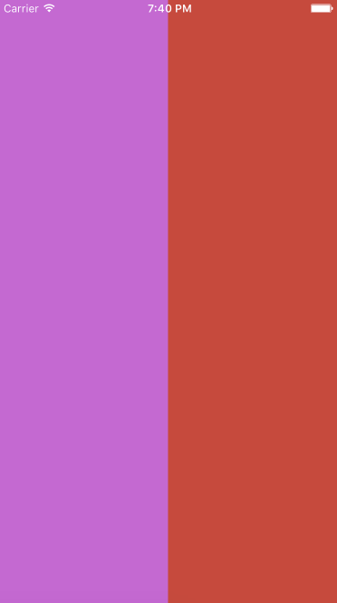
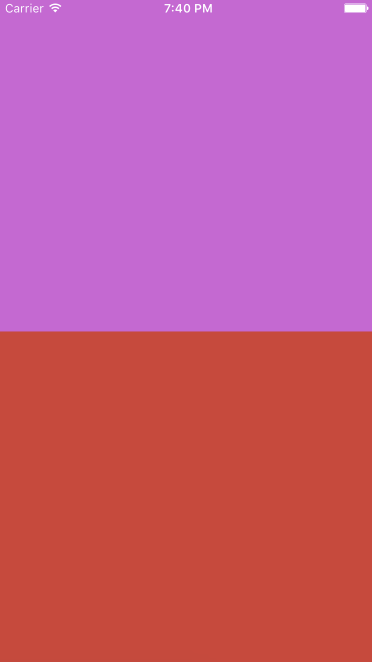
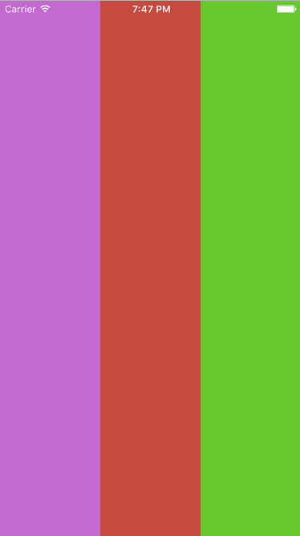
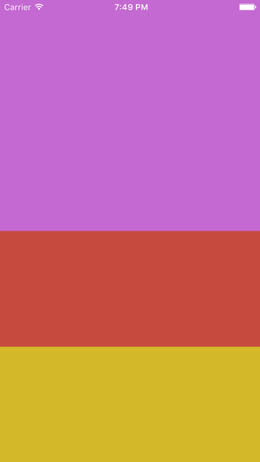
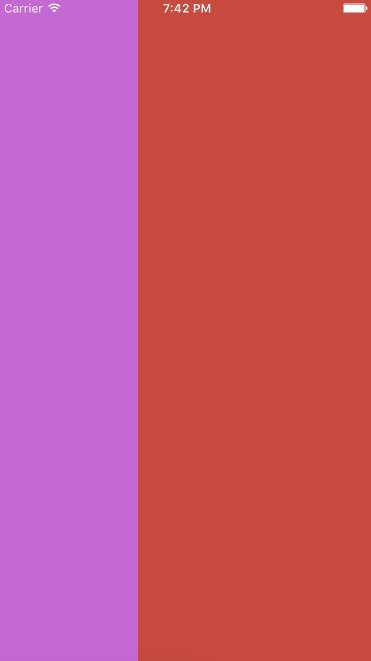

# React Native Easy Grid 🐵

This is NOT-JUST-ANOTHER-GRID-LAYOUT library! We are trying to simplify flexbox with easier approach.

## Installation

```
npm install react-native-easy-grid --save
```

## Usage

### Include the components

```
import { Col, Row, Grid } from "react-native-easy-grid";
```

### 1. Two columns (50% and 50%)

```
<Grid>
    <Col></Col>
    <Col></Col>
</Grid>
```




> Note: If you don't assign the size property, it defaults to equal width (or height) with its siblings

### 2. Two rows

```
<Grid>
    <Row></Row>
    <Row></Row>
</Grid>
```




### 3. Two rows (75% and 25%)

```
<Grid>
    <Row size={75}></Row>
    <Row size={25}></Row>
</Grid>
```

This is exactly same as

```
<Grid>
    <Row size={3}></Row>
    <Row size={1}></Row>
</Grid>
```


> Same concept applies to `<Col />`


### 4. Three columns (33.33% each)

```
<Grid>
    <Col></Col>
    <Col></Col>
    <Col></Col>
</Grid>
```


### 5. Three rows (50%, 25% and 25%)

```
<Grid>
    <Row size={2}></Row>
    <Row size={1}></Row>
    <Row size={1}></Row>
</Grid>
```



### 6. Nested Layout or Grid

<table width="100" height="100">
	<tr>
		<td rowspan="2" bgcolor="red" width="50">1</td>
		<td bgcolor="yellow" width="50" height="50">2</td>
	</tr>
	<tr>
		<td bgcolor="blue">3</td>
	</tr>
</table>

```
<Grid>
	<Col>1</Col>
	<Col>
		<Row>2</Row>
		<Row>3</Row>
	</Col>
</Grid>
```


### 7. Fixed width and fluid width combination

```
<Grid>
	<Col style={{ width: 40 }}> Fixed width </Col>
	<Col> Fluid width </Col>
</Grid>
```




### 8. Fixed height and fluid height combination

```
<Grid>
	<Row style={{ height: 40 }}> Fixed width </Row>
	<Row> Fluid width </Row>
</Grid>
```

Do you think anything could be simpler than that? This repo is part of our bigger project called [NativeBase.io](http://nativebase.io). Do check that!

# Important note about usage with `<ScrollView />`

> Note: If you're using `<Row />` inside a `<ScrollView />`, the height of the <Row /> component would be flexible according to the content, though you can always apply the `height` styling.
